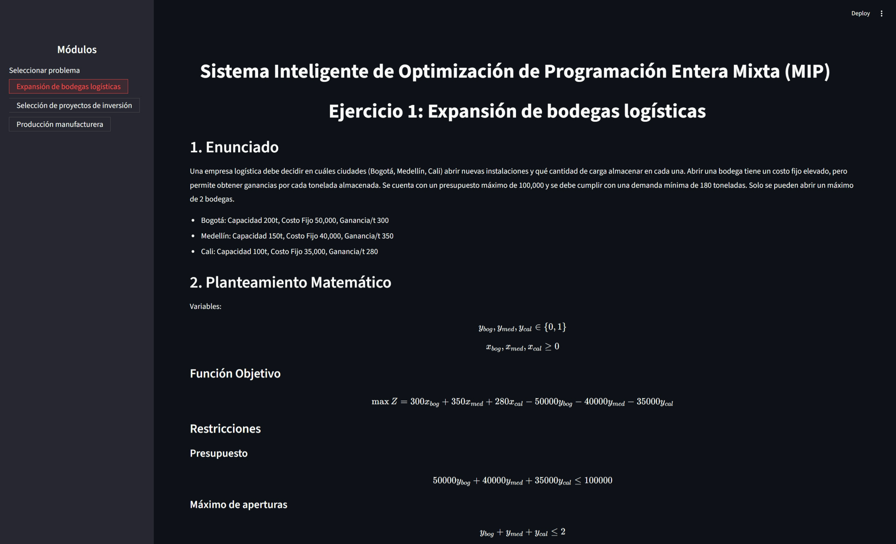
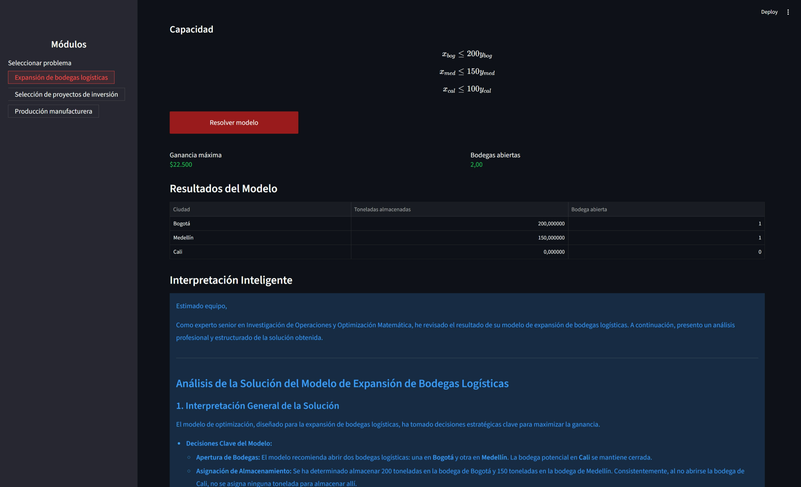
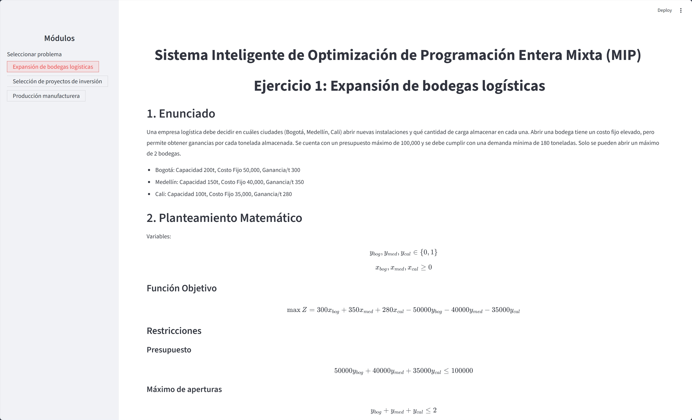
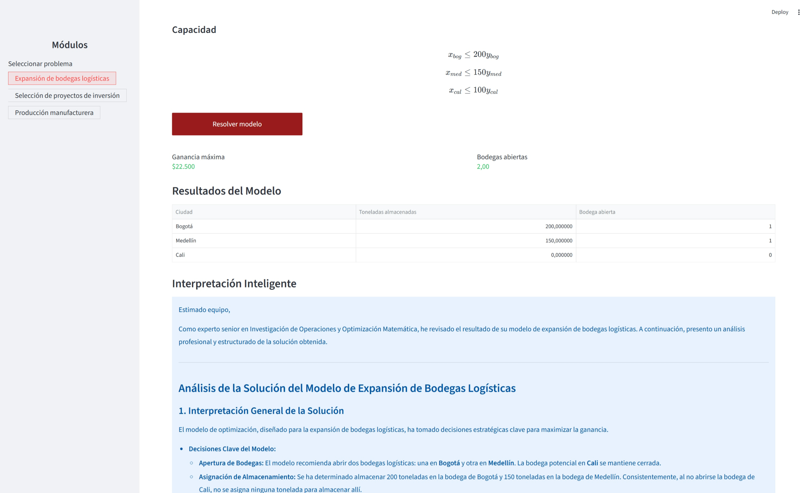

# Proyecto Final Investigación de Operaciones II

Agente inteligente basado en Investigación de Operaciones para resolver problemas de Programación Entera Mixta (MIP) utilizando optimización matemática e Inteligencia Artificial.

## Vista de la aplicación

### Tema oscuro

#### Pantalla principal


#### Resultados y análisis inteligente


---

### Tema claro

#### Pantalla principal


#### Resultados y análisis inteligente



## Características

- Resolución de modelos MIP con PuLP.
- Interfaz web interactiva con Streamlit.
- Interpretación inteligente de resultados usando Gemini API.
- Explicación matemática y análisis de escenarios.
- Visualización clara de métricas y tablas.
- Arquitectura modular y limpia.

## Tecnologías

- Python
- PuLP
- Streamlit
- Gemini API
- UV
- Ruff


## Instalación

```bash
uv sync
```


## Configuración

Crear un archivo `.env` en la raíz del proyecto:

```env
GEMINI_API_KEY=tu_api_key
```


## Ejecución

```bash
uv run streamlit run main.py
```


## Problemas implementados

### 1. Expansión de bodegas logísticas

Optimización de apertura de bodegas y distribución de carga bajo restricciones de:

- presupuesto,
- capacidad,
- demanda mínima,
- número máximo de instalaciones.


### 2. Selección de proyectos de inversión

Selección óptima de proyectos considerando:

- ROI,
- restricciones de capital,
- exclusión mutua,
- límites mínimos y máximos de inversión.


### 3. Producción manufacturera

Planeación de producción en líneas manufactureras considerando:

- capacidades de línea,
- costos fijos,
- demandas máximas,
- asignación óptima de productos.

## Integrantes

- Juan Esteban Bedoya Lautero
